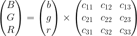
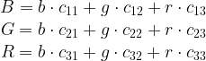

## Assignment: Sepia Filter

---
See previous assignment: [Assignment Image Rotation](https://github.com/insaniss/low-level-programming/tree/assignment-image-rotation)

### Sepia Filter

A sepia filter makes an image with vivid colors look like an old, aged photograph.
Most graphical editors include a sepia filter.

The filter itself is not hard to code. It recalculates the red, greed, and blue
components of each pixel based on the old values of red, green and blue.
Mathematically, if we think about a pixel as a three-dimensional vector, the
transformation is nothing but a multiplication of a vector by matrix.

Let the new pixel value be (*B* *G* *R*)<sup>*T*</sup> (where *T* superscript 
stands for transposition). *B*, *G*, *R* stand for blue, green, and red levels. 
In vector from the transformation can be described as follows:

<p align="center">
  
</p>

In scalar form, we can rewrite it as

<p align="center">
  
</p>

We will have to use saturation arithmetic. It means, that all operations such as
addition and multiplication are limited to a fixed range between a minimum and
maximum value. Out typical machine arithmetic is modular: if the result is greater
than the maximum value, we will come from the different side of the range. For 
example, for `unsigned char`: 200 + 100 = 300 mod 256 = 44. Saturation arithmetic
implies that for the same range between 0 and 255 included 200 + 100 = 255 since
it is the maximum value in range.

C does not implement such arithmetic, so we will have to check for overflows 
manually. SSE contains instructions that convert floating point values to single
byte integers with saturation.

Performing the transformation in C is easy. It demands direct encoding of the 
matrix to vector multiplication and taking saturation into account.

```c
// image_sepia_c_example.c
#include <inttypes.h>

struct pixel { uint8_t b, r, g; };

struct image {
  uint32_t width, height;
  struct pixel *array;
};

static unsigned char sat( uint64_t x ) {
  if ( x < 256 ) return x; return 255;
}

static void sepia_one( struct pixel *const pixel ) {
  static const float c[3][3] = {
     { .393f, .769f, .189f },
     { .349f, .686f, .168f },
     { .272f, .543f, .131f }
  };
  struct pixel const old = *pixel;
  pixel->r = sat(
    old.r * c[0][0] + old.g * c[0][1] + old.b * c[0][2]);
  pixel->g = sat(
    old.r * c[1][0] + old.g * c[1][1] + old.b * c[1][2]);
  pixel->b = sat(
    old.r * c[2][0] + old.g * c[2][1] + old.b * c[2][2]);
}

void sepia_c_inplace( struct image *img ) {
  uint32_t x, y;
  for ( y = 0; y < img->height; y++ )
    for ( x = 0; x < img->width; x++)
      sepia_one( pixel_of( *img, x, y ) );
}
```

Note that using `uint8_t` or `unsigned char` is very important.
In this assignment you have to

* Implement in a separate file a routine to apply a filter to a big par of image
  (except for the last pixels maybe). It will operate on chunks of multiple pixels 
  at a time using SSE instructions.

The last few pixels that did not fill the last chunk can be processed one by one 
using the C code provided in listing above.

* Make sure that both C and assembly versions produce similar results.
* Compile two programs; the first should use a naive C approach and the second 
  one should use SSE instructions.
* Compare the time of execution of C and SSE using a huge image as an input 
  (preferably hundreds of megabytes).
* Repeat the comparison multiple times and calculate the average values for SSE
  and C;
